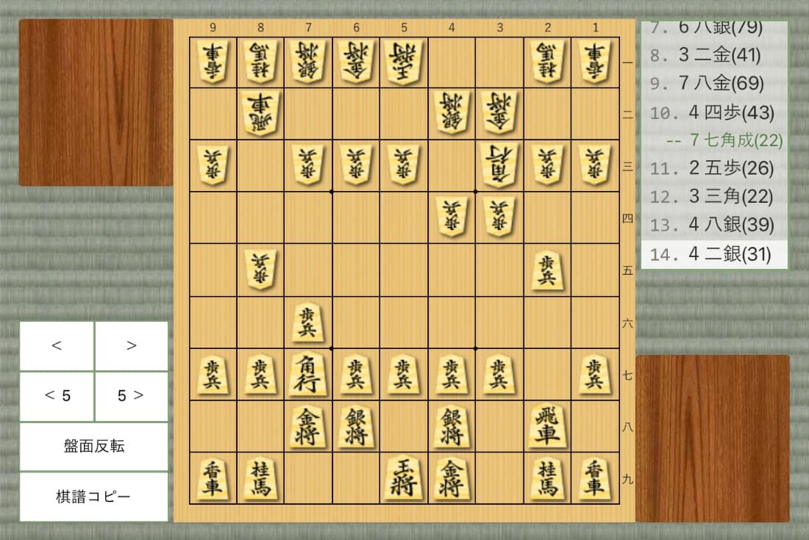

# Shogi Board・ブラウザ将棋盤

[](https://circleci.com/gh/murosan/shogi-board)
[](https://codecov.io/gh/murosan/shogi-board)
[](https://github.com/facebook/jest)
[](https://github.com/prettier/prettier)
[](https://opensource.org/licenses/MIT)
[](https://github.com/murosan/shogi-board/releases)
[](https://nodejs.org/ja/)

まずは Playground(Web 将棋盤) でお試しください  
<https://murosan.github.io/shogi-board/playground/>

ドキュメントはこちら  
<https://murosan.github.io/shogi-board/>

<div style="width: 80%">
  
</div>

## できること

- ブラウザ上で駒を動かして将棋の検討や棋譜並べができる

## 使い方

ソースコードと、依存ライブラリのダウンロード

```sh
git clone git@github.com:murosan/shogi-board.git
cd shogi-board
yarn
```

開発サーバーを立ち上げる

```sh
yarn start
# chrome で
# http://localhost:3000/ にアクセス
```

## ライセンス

### ソースコード

[MIT License](./LICENSE)

### 駒の画像

<a rel="license" href="http://creativecommons.org/licenses/by-nc-sa/4.0/deed.ja" target="_blank"></a><br />
<a rel="license" href="http://creativecommons.org/licenses/by-nc-sa/4.0/deed.ja" target="_blank">クリエイティブ・コモンズ 表示 - 非営利 - 継承 4.0 国際 ライセンス</a>

利用する際は、[このページ](https://github.com/murosan/shogi-board)か[Shogi Board](https://murosan.github.io/shogi-board/)のリンク（または両方）と  
著作者（murosan）をクレジット表示してください。

### その他の画像

- 盤面(色調改変あり)

  by [muchonovski](http://mucho.girly.jp/bona)  
  under [Creative Commons 表示-非営利 2.1 日本 License](https://creativecommons.org/licenses/by-nc/2.1/jp/)

- 畳

  [フリーテクスチャ素材館](https://free-texture.net/seamless-pattern/tatami01.html)

- その他

  free material
